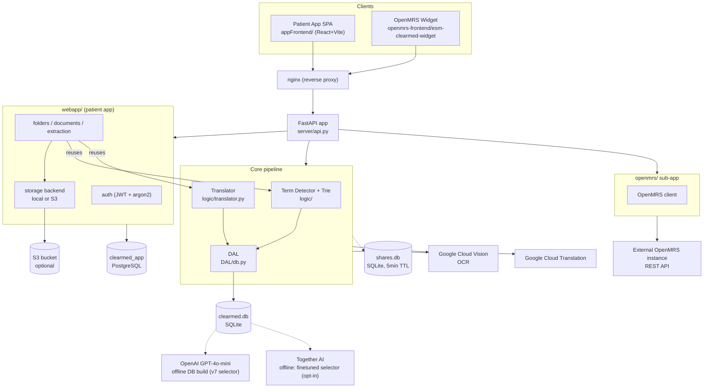
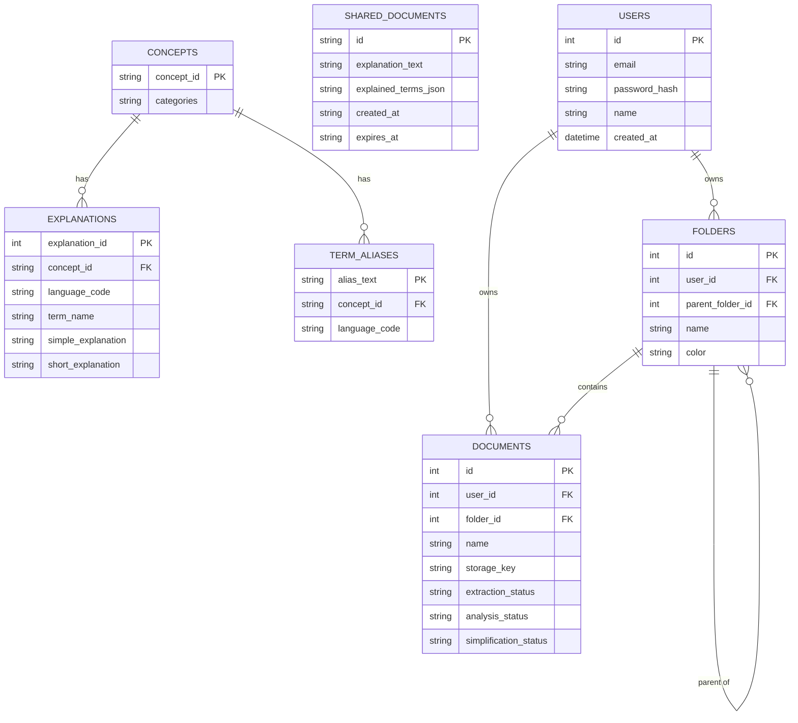
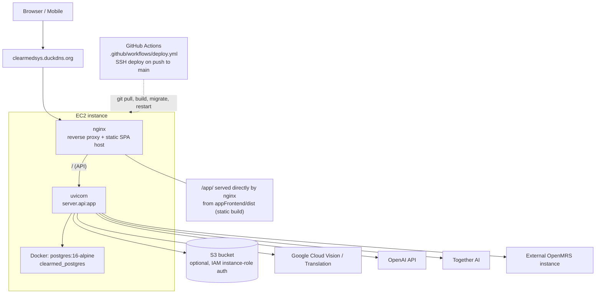

# ClearMed

ClearMed detects medical terms in an uploaded document (`.txt` or `.pdf`) and explains
them in patient-friendly language, sourced from [MedlinePlus](https://medlineplus.gov/),
a health information service of the U.S. National Library of Medicine (NIH).

---

## Features

### Currently available

* **Patient app** — accounts, folders, and a document library (`webapp/` + `appFrontend/`),
  with documents stored locally or in S3
* Medical term detection in uploaded documents via a trie-based matcher, with
  patient-friendly explanations sourced from MedlinePlus (NIH)
* Rewrite/simplify document text using only the terms the patient approved
* Upload a document by taking a picture on mobile (device camera + Google Cloud Vision OCR)
* Multi-language translation of simplified documents (Google Cloud Translation)
* QR-code document sharing (short-lived, 5-minute link)
* OpenMRS EHR integration — a widget embedded in a patient's OpenMRS chart
  (`openmrs/` + `openmrs-frontend/`)
* Offline database build pipeline from MedlinePlus XML, with a choice of selector for
  picking each term's short explanation: GPT-4o-mini (`v7`, default) or a **fine-tuned
  open model** (opt-in) — see [Fine-Tuning](#fine-tuning)

### Planned

* Tone adjusting for explanations
* OAuth login (Google/Apple) — buttons exist in the patient-app UI but are not yet functional

---

## Architecture



---

## Database Architecture

ClearMed uses three separate databases, deliberately kept apart:

* **`clearmed.db`** (SQLite) — the read-only medical-terms database, accessed via raw
  `sqlite3` (`DAL/db.py`). Built offline by `server_init/`.
* **`shares.db`** (SQLite) — ephemeral QR-share links, no foreign key to the other DBs;
  rows are deleted once their 5-minute TTL expires.
* **`clearmed_app`** (PostgreSQL) — the patient app's database, accessed via SQLAlchemy
  with Alembic migrations (`alembic/versions/`).



---

## Project Structure

```text
ClearMed/
│
├── server/              ← FastAPI app and routes (api.py), mounts webapp/ and openmrs/
├── logic/                ← term detection (trie), translation, sharing
├── DAL/                  ← data access layer over clearmed.db / shares.db (SQLite)
├── data_preparation/     ← offline, rarely run: scrapes/converts raw sources into JSON
│                            (health_topics.xml lives here)
├── server_init/          ← offline: builds clearmed.db (v7 or finetuned selector)
│
├── webapp/               ← patient app backend: auth, folders, documents, extraction, storage
├── appFrontend/          ← patient app frontend (React + Vite + Tailwind)
├── alembic/              ← Postgres migrations for webapp/
│
├── openmrs/              ← OpenMRS integration sub-app (server-to-server REST client)
├── openmrs-frontend/     ← OpenMRS 3.x microfrontend widget
│
├── finetuning/           ← fine-tuning experiments for the short-explanation selector
├── tests/                ← test suite
│
├── clearmed.db           ← SQLite term database
├── docker-compose.yml    ← local/production Postgres container
├── requirements.txt
└── README.md
```

---

## Patient App

The patient app is the primary product — accounts, folders, a document library, and
document analysis/translation, served from:

https://clearmedsys.duckdns.org/app/

---

## API endpoints

**Core**

| Method | Path                 | Purpose                                                          |
| ------ | -------------------- | ----------------------------------------------------------------- |
| POST   | `/analyse`           | Detect medical terms in `{text}`, return them with explanations.  |
| POST   | `/translate`         | Rewrite `{text}` using only the approved terms in `{ui_selection}`.|
| POST   | `/ocr`                | Extract text from a photographed document via Google Cloud Vision.|
| GET    | `/languages`          | List supported translation languages.                             |
| POST   | `/translate-document` | Translate a simplified document into another language.            |

**Sharing**

| Method | Path                     | Purpose                                     |
| ------ | ------------------------ | ---------------------------------------------|
| POST   | `/shares`                | Create a short-lived (5-minute) share link.  |
| GET    | `/shares/{id}`           | Fetch a shared document's content.           |
| POST   | `/shares/{id}/translate` | Translate a shared document.                 |

**Auth** (`webapp/`)

| Method | Path             | Purpose               |
| ------ | ---------------- | -----------------------|
| POST   | `/auth/register` | Create an account.     |
| POST   | `/auth/login`     | Log in (JWT cookie).   |
| POST   | `/auth/logout`    | Log out.               |
| GET    | `/auth/me`        | Current user info.     |

**Folders & documents** (`webapp/`)

CRUD endpoints for folders and documents (create/list/update/delete), plus per-document
upload, extraction, analysis, and simplification actions.

**OpenMRS** (`openmrs/`, own CORS scope)

| Method | Path                             | Purpose                                    |
| ------ | -------------------------------- | ---------------------------------------------|
| GET    | `/openmrs/patients/{uuid}`       | Fetch a patient from the OpenMRS instance.   |
| POST   | `/openmrs/observations`          | Write an observation back to OpenMRS.        |
| GET    | `/openmrs/patients/{uuid}/notes` | List notes for a patient.                    |
| POST   | `/openmrs/analyse`               | Same as `/analyse`, scoped to the widget's CORS origin. |
| POST   | `/openmrs/translate`             | Same as `/translate`, scoped to the widget's CORS origin. |

---

## Deployment



`.github/workflows/deploy.yml` automatically deploys to an EC2 instance on every push
to `main`: it SSHs in, `git pull`s, builds the `appFrontend/` React app, installs
Python deps, runs pending `alembic` migrations, and restarts `uvicorn` -- failing the
deploy loudly (with the last 50 lines of `output.log`) if the server doesn't come back
up, instead of leaving a crashed process behind a still-"successful" nginx proxy.

Document storage for the patient app defaults to the local disk (`STORAGE_BACKEND=local`);
setting `STORAGE_BACKEND=s3` switches to an S3 bucket, authenticated via the EC2
instance's IAM role (no static AWS keys in `.env`).

### One-time production box setup

The automated deploy assumes the box already has this in place. On a fresh EC2
instance (or after replacing the current one), set these up once by hand first:

* **`~/clearmed/.env`** -- not tracked in git. Copy `.env.example` and fill in real
  values, at minimum `JWT_SECRET_KEY` (`python -c "import secrets; print(secrets.token_hex(32))"`)
  and `ENVIRONMENT=production`. A missing `JWT_SECRET_KEY` crashes the *entire* app at
  import time (not just the patient-app routes), which is a common cause of a
  site-wide 502.
* **Node.js + pnpm**, for building `appFrontend/`. Amazon Linux 2023's `dnf` Node
  package is too old for this project's Vite version; install via
  [nvm](https://github.com/nvm-sh/nvm) instead: `nvm install 20 && npm install -g pnpm`.
* **Docker + the Compose plugin**, for the patient-app's Postgres database
  (`docker-compose.yml`). AL2023 doesn't package `docker-compose-plugin`; install the
  plugin binary directly per
  [Docker's docs](https://docs.docker.com/compose/install/linux/#install-the-plugin-manually).
  Then `docker compose up -d` once to create the `clearmed_postgres` container (the
  deploy script does not start it for you).
* **nginx**: `/etc/nginx/conf.d/clearmed.conf` needs a `location /app/` block serving
  `appFrontend/dist/` (via `alias`, with `try_files $uri $uri/ /app/index.html` for
  client-side routing), alongside the existing `location /` proxy to
  `http://127.0.0.1:8000`. Confirm the nginx worker user can traverse into
  `~/clearmed` (`sudo -u nginx stat ~/clearmed/appFrontend/dist/index.html`).

Once those are in place, every subsequent `git push` to `main` redeploys both the
API and the frontend, and applies any new `alembic` migrations, without manual steps.

---

## Fine-Tuning

The offline database build picks a **short explanation** for each medical term — one
sentence from its MedlinePlus source text, chosen to stand alone as a patient-facing
definition. This is a *classification* task (`{"selected_index": N}`, choosing among
existing sentences), not text generation.

Production default (`v7`) uses `gpt-4o-mini` with a heuristic fallback. `finetuning/`
explores whether a small, cheaply-hosted open model, fine-tuned on human-labeled
examples of this exact decision, can match or beat it:

* **Experiment 1** — baseline LoRA fine-tune of `Qwen/Qwen3.5-9B` on Together AI; a
  partial run (billing cutoff) that surfaced a strong index-0 position bias.
* **Experiment 2** — fixed the position bias (shuffled twins) and distribution skew
  (45 new stratified-sampled labels), and fixed a JSON-format-reliability problem by
  switching to a strict `json_schema` response format (0 format failures vs. 26/50
  initially). This is the canonical fine-tuned result to date.
* **Experiment 3** — in progress: collecting additional labeled data targeting the two
  largest error clusters from Experiment 2's review (generic-vs-functional and
  related-fact-vs-explanation mismatches, together ~71% of its wrong picks).

The Experiment 3 model is wired into production as an **opt-in alternative**, never the
default: setting `SHORT_EXPLANATION_SELECTOR=finetuned` (default `v7`) makes
`server_init/build_finetuned_db.py` build a separate `clearmed_finetuned.db` using a
Together AI dedicated endpoint — the live `clearmed.db` is untouched either way.

Full experiment history, dataset methodology, and reproduction steps:
[finetuning/README.md](finetuning/README.md).

---

## Try the OpenMRS widget

An OpenMRS 3.x microfrontend widget (`openmrs-frontend/esm-clearmed-widget/`)
adds a "ClearMed" tab to the patient chart, calling the already-deployed
backend above — no database build or local ClearMed server needed.

```bash
cd openmrs-frontend/esm-clearmed-widget
npm install
```

`dev3.openmrs.org`'s live `routes.registry.json` endpoint currently returns
its app list wrapped one level too deep (a confirmed bug on that server, not
this repo) — work around it once per session:

```bash
curl -s "https://dev3.openmrs.org/openmrs/spa/routes.registry.json" \
  | python3 -c "import json,sys; json.dump(json.load(sys.stdin)['routes'], open('routes.registry.fixed.json','w'))"
```

Then start the dev shell:

```bash
npm start -- --backend https://dev3.openmrs.org --routes routes.registry.fixed.json
```

Open the printed URL (e.g. `http://localhost:8080/openmrs/spa`), log in with
the `dev3.openmrs.org` demo credentials (`admin` / `Admin123`), open any
patient's chart, and click the **ClearMed** tab.

---

## Authors

**Tal Gershanov**

GitHub: https://github.com/TalGershanov

**Yuval Bashan**

GitHub: https://github.com/YuvalBashan
