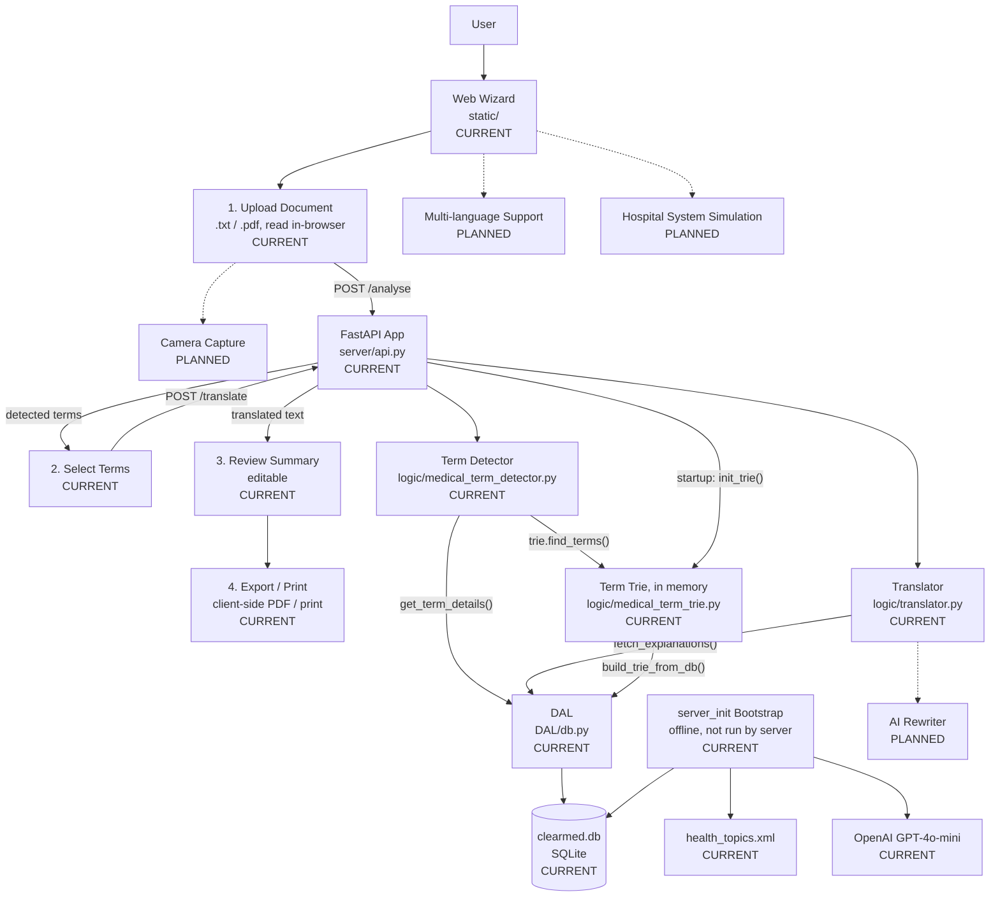

# ClearMed

ClearMed detects medical terms in an uploaded document (`.txt` or `.pdf`) and explains
them in patient-friendly language, sourced from [MedlinePlus](https://medlineplus.gov/),
a health information service of the U.S. National Library of Medicine (NIH).

---

## Features

### Currently available

* Detect medical terms in an uploaded document via a trie-based matcher
* Patient-friendly term explanations sourced from MedlinePlus (NIH)
* Interactive 4-step web wizard: upload → select terms → review summary → export/print
* Rewrite/annotate document text using only the terms the patient approved
* Offline database build pipeline from MedlinePlus XML, using GPT-4o-mini to generate
  each term's patient-facing explanation
* Hospital system simulation
* Upload a document by taking a picture on mobile
  
### Planned

* Multiple language support
* AI fine-tuning to reword and shorten the explanation paragraphs
* tone adjusting 

---

## Architecture

The architecture below shows both the **current project** and the features planned
for the future.



**CURRENT** = already implemented

**PLANNED** = planned for a future version

---

## Project Structure

```text
ClearMed/
│
├── server/            ← FastAPI app and routes (api.py)
├── logic/             ← term detection (trie) + translation
├── DAL/               ← data access layer over clearmed.db (SQLite)
├── server_init/       ← offline: builds clearmed.db from health_topics.xml
├── static/            ← frontend wizard (upload → select → review → export)
│
├── health_topics.xml  ← MedlinePlus source data
├── clearmed.db         ← SQLite term database
├── requirements.txt
└── README.md
```

---

## Website

https://clearmed.duckdns.org

---

## API endpoints

| Method | Path          | Purpose                                                            |
| ------ | ------------- | ------------------------------------------------------------------- |
| POST   | `/analyse`    | Detect medical terms in `{text}`, return them with explanations.    |
| POST   | `/translate`  | Rewrite `{text}` using only the approved terms in `{ui_selection}`. |

---

## Deployment

`.github/workflows/deploy.yml` automatically deploys to an EC2 instance on every push
to `main`: it SSHs in, `git pull`s, and restarts `uvicorn`.

---

## Try the OpenMRS widget

An OpenMRS 3.x microfrontend widget (`openmrs-frontend/esm-clearmed-widget/`)
adds a "ClearMed" tab to the patient chart, calling the already-deployed
backend above — no database build or local ClearMed server needed.

```bash
cd openmrs-frontend/esm-clearmed-widget
npm install
```

`dev3.openmrs.org`'s live `routes.registry.json` endpoint currently returns
its app list wrapped one level too deep (a confirmed bug on that server, not
this repo) — work around it once per session:

```bash
curl -s "https://dev3.openmrs.org/openmrs/spa/routes.registry.json" \
  | python3 -c "import json,sys; json.dump(json.load(sys.stdin)['routes'], open('routes.registry.fixed.json','w'))"
```

Then start the dev shell:

```bash
npm start -- --backend https://dev3.openmrs.org --routes routes.registry.fixed.json
```

Open the printed URL (e.g. `http://localhost:8080/openmrs/spa`), log in with
the `dev3.openmrs.org` demo credentials (`admin` / `Admin123`), open any
patient's chart, and click the **ClearMed** tab.

---

## Authors

**Tal Gershanov**

GitHub: https://github.com/TalGershanov

**Yuval Bashan**

GitHub: https://github.com/YuvalBashan
